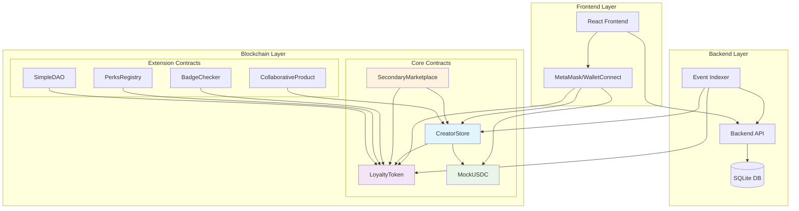
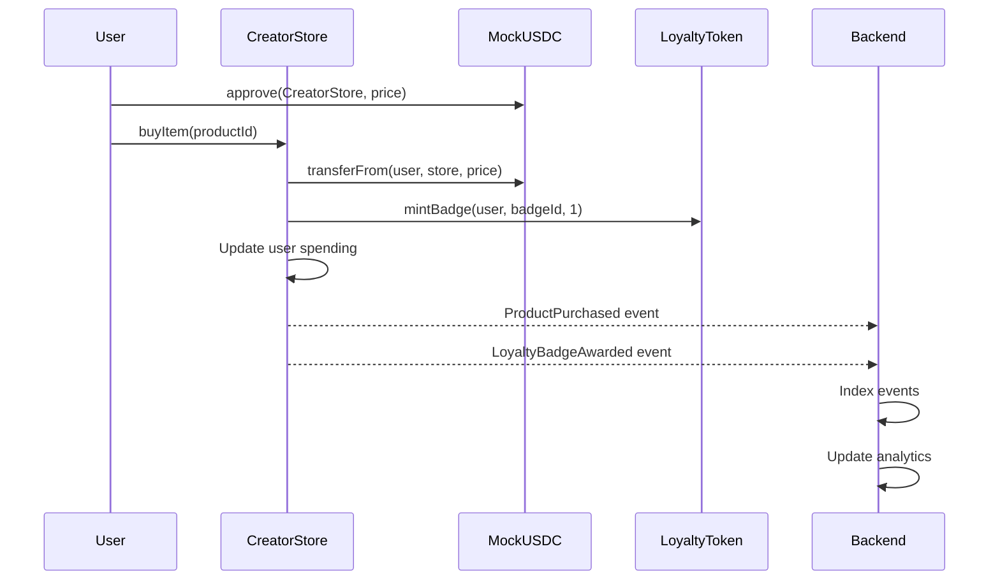
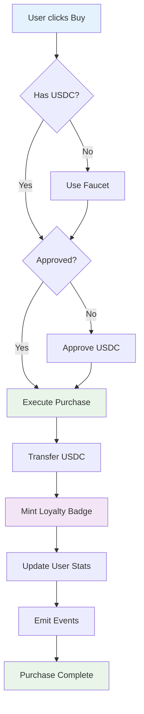
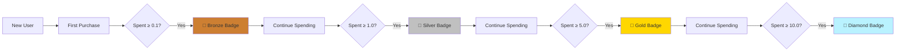

# KudoBit Smart Contracts

> **The Web3 Gumroad** - Smart contract infrastructure for decentralized creator monetization with instant loyalty rewards.

## 🚀 Quick Start

```bash
# Compile contracts
npm run compile

# Run tests
npm test

# Deploy to local network
npm run deploy:local:node

# Deploy to hardhat network
npm run deploy:local
```

## 📋 Table of Contents

- [Architecture Overview](#-architecture-overview)
- [Core Contracts](#-core-contracts)
- [Extensions](#-extensions)
- [Contract Interactions](#-contract-interactions)
- [Deployment](#-deployment)
- [Testing](#-testing)
- [Security](#-security)

## 🏗️ Architecture Overview



## 🔐 Core Contracts

### CreatorStore.sol
**The heart of the KudoBit ecosystem** - Handles product listings, purchases, and loyalty rewards.

```solidity
struct Product {
    uint256 id;
    string name;
    string description;
    string ipfsContentHash;
    uint256 priceInUSDC;
    bool isActive;
    uint256 loyaltyBadgeId;
}
```

**Key Features:**
- ✅ Product listing and management
- ✅ USDC-based payments
- ✅ Automatic loyalty badge awards
- ✅ Royalty splitting
- ✅ Purchase tracking
- ✅ Loyalty tier progression

**Loyalty Tiers:**
```solidity
uint256 public constant BRONZE_THRESHOLD = 100000;   // 0.1 USDC
uint256 public constant SILVER_THRESHOLD = 1000000;  // 1.0 USDC  
uint256 public constant GOLD_THRESHOLD = 5000000;    // 5.0 USDC
uint256 public constant DIAMOND_THRESHOLD = 10000000; // 10.0 USDC
```

### LoyaltyToken.sol
**ERC1155 NFT badges** - Represents user loyalty levels and unlocks perks.

```solidity
uint256 public constant BRONZE_BADGE = 1;
uint256 public constant SILVER_BADGE = 2;
uint256 public constant GOLD_BADGE = 3;
uint256 public constant DIAMOND_BADGE = 4;
```

**Features:**
- ✅ Multi-tier badge system
- ✅ Authorized minter pattern
- ✅ Metadata URIs for badge assets
- ✅ OpenSea compatible

### MockUSDC.sol
**Test payment token** - ERC20 token for development and testing (located in `mocks/`).

**Features:**
- ✅ 6 decimal precision (like real USDC)
- ✅ Faucet function for testing
- ✅ Standard ERC20 interface

### SecondaryMarketplace.sol
**Resale marketplace** - Enables users to resell purchased digital products.

**Features:**
- ✅ Product resale listings
- ✅ Platform fee collection
- ✅ Creator royalties
- ✅ Purchase history tracking

## 🔧 Extensions

### BadgeChecker.sol
Utility contract for badge-gated functionality.

```solidity
struct BadgeRequirement {
    address badgeContract;
    uint256 badgeId;
    uint256 minimumAmount;
}
```

### PerksRegistry.sol
Manages creator-defined perks and rewards.

```solidity
struct Perk {
    uint256 id;
    address creator;
    string name;
    string description;
    uint256 requiredBadgeId;
    bool isActive;
}
```

### CollaborativeProductFactory.sol
Enables collaborative product creation with revenue sharing.

### SimpleKudoBitDAO.sol
Governance system for platform decisions.

**Features:**
- ✅ Proposal creation
- ✅ Badge-weighted voting
- ✅ Execution timelock

## 🔄 Contract Interactions



### Purchase Flow



### Loyalty System



## 🚀 Deployment

### Local Development
```bash
# Start Hardhat node
npx hardhat node

# Deploy contracts
npm run deploy:local:node

# Contracts will be deployed to:
# - MockUSDC: 0x5FbDB2315678afecb367f032d93F642f64180aa3
# - LoyaltyToken: 0xe7f1725E7734CE288F8367e1Bb143E90bb3F0512
# - CreatorStore: 0xCf7Ed3AccA5a467e9e704C703E8D87F634fB0Fc9
```

### Test Network (Morph Holesky)
```bash
# Set environment variables
export PRIVATE_KEY="your-private-key"
export MORPH_RPC_URL="https://rpc-quicknode-holesky.morphl2.io"

# Deploy to testnet
npx hardhat run scripts/deploy-core.cjs --network morphHolesky
```

### Contract Addresses

#### Local Development
| Contract | Address |
|----------|---------|
| MockUSDC | `0x5FbDB2315678afecb367f032d93F642f64180aa3` |
| LoyaltyToken | `0xe7f1725E7734CE288F8367e1Bb143E90bb3F0512` |
| CreatorStore | `0xCf7Ed3AccA5a467e9e704C703E8D87F634fB0Fc9` |
| SecondaryMarketplace | `0x9fE46736679d2D9a65F0992F2272dE9f3c7fa6e0` |

#### Morph Holesky Testnet
| Contract | Address |
|----------|---------|
| MockUSDC | `0x1dA0552f45cC89be39A2BF53Ef1c75859894D5dd` |
| LoyaltyToken | `0x89de622217c01f4c97453a35CaFfF1E7b7D6f8FC` |
| CreatorStore | `0x203B1f821F726d596b57C1399906EF338b98b9FF` |

## 🧪 Testing

### Test Structure
```
test/
├── core-contracts-test.cjs      # Core functionality tests
├── comprehensive-test.js        # Integration tests
└── unit/                        # Individual contract tests
    ├── CreatorStore.test.cjs
    ├── LoyaltyToken.test.cjs
    └── MockUSDC.test.cjs
```

### Running Tests
```bash
# Run all tests
npm test

# Run specific test
npx hardhat test test/core-contracts-test.cjs

# Run with gas reporting
REPORT_GAS=true npm test

# Run tests with coverage
npm run test:coverage
```

### Test Coverage
- ✅ **MockUSDC**: Faucet, transfers, approvals
- ✅ **LoyaltyToken**: Badge minting, authorization
- ✅ **CreatorStore**: Product CRUD, purchases, loyalty
- ✅ **Security**: Access control, reentrancy protection
- ✅ **Integration**: End-to-end user workflows

## 🛡️ Security

### Security Measures
- ✅ **OpenZeppelin Contracts** - Battle-tested implementations
- ✅ **ReentrancyGuard** - Prevents reentrancy attacks
- ✅ **Ownable** - Access control for admin functions
- ✅ **SafeERC20** - Safe token transfers
- ✅ **Input Validation** - Comprehensive checks

### Audit Considerations
- ✅ No external calls in loops
- ✅ Proper access controls
- ✅ Event emission for transparency
- ✅ Gas optimization
- ✅ Upgrade patterns considered

### Known Limitations
- 🔄 **Upgradability**: Contracts are not upgradeable (by design)
- 🔄 **Governance**: Simple governance model
- 🔄 **Scalability**: Gas costs may be high on mainnet

## 📊 Gas Estimates

| Function | Gas Cost | Description |
|----------|----------|-------------|
| `buyItem()` | ~150k | Purchase + badge mint |
| `listProduct()` | ~100k | Create new product |
| `faucet()` | ~50k | Get test USDC |
| `mintBadge()` | ~80k | Manual badge mint |

## 🔧 Configuration

### Hardhat Config
```javascript
networks: {
  hardhat: { chainId: 1337 },
  localhost: { url: "http://localhost:8545" },
  morphHolesky: {
    url: "https://rpc-quicknode-holesky.morphl2.io",
    accounts: [process.env.PRIVATE_KEY],
    chainId: 2810
  }
}
```

### Environment Variables
```env
PRIVATE_KEY=your-private-key-here
MORPH_RPC_URL=https://rpc-quicknode-holesky.morphl2.io
ETHERSCAN_API_KEY=your-etherscan-key
```

## 📁 File Structure

Following **Hardhat/Foundry best practices** for smart contract organization:

```
contracts/
├── 📄 README.md                    # This file
│
├── 📁 core/                        # Core protocol contracts
│   ├── CreatorStore.sol            # Main marketplace contract
│   ├── LoyaltyToken.sol            # ERC1155 badge system
│   └── SecondaryMarketplace.sol    # Resale marketplace
│
├── 📁 extensions/                  # Optional extensions
│   ├── BadgeChecker.sol            # Badge verification utility
│   ├── PerksRegistry.sol           # Creator perks management
│   ├── CollaborativeProductFactory.sol # Collaborative products
│   ├── SimpleKudoBitDAO.sol        # Governance system
│   ├── AffiliateProgram.sol        # Affiliate marketing
│   ├── SubscriptionTiers.sol       # Subscription model
│   ├── TippingAndCrowdfunding.sol  # Tipping system
│   ├── GamefiedEngagement.sol      # Gamification features
│   └── NFTGatedContent.sol         # NFT-gated access
│
├── 📁 interfaces/                  # Contract interfaces
│   └── (Reserved for future interfaces)
│
├── 📁 libraries/                   # Reusable libraries
│   └── (Reserved for future libraries)
│
├── 📁 mocks/                       # Mock contracts for testing
│   └── MockUSDC.sol                # Test payment token
│
├── 📁 utils/                       # Utility contracts
│   └── (Reserved for future utilities)
│
└── 📁 legacy/                      # Legacy contracts
    ├── Shopfront.sol               # Original marketplace
    └── ShopfrontETH.sol            # ETH-based version
```

### ✅ Structure Benefits

This organization follows **widely adopted standards** used by top DeFi projects:

- **📁 core/** - Essential contracts that define the project's main functionality
- **📁 interfaces/** - Contract interfaces for interoperability (IYourContract.sol)
- **📁 libraries/** - Reusable code libraries for gas optimization
- **📁 mocks/** - Test-only contracts isolated from production code
- **📁 utils/** - Helper contracts and utilities
- **📁 extensions/** - Optional features that extend core functionality
- **📁 legacy/** - Deprecated contracts kept for reference

### ✅ Tested & Verified

All contracts compile successfully and pass comprehensive tests after restructuring.

## 🎯 Roadmap

### Phase 1: Core ✅
- ✅ Basic marketplace functionality
- ✅ Loyalty badge system
- ✅ USDC payments
- ✅ Local development setup

### Phase 2: Extensions 🔄
- 🔄 Secondary marketplace
- 🔄 Creator perks system
- 🔄 Badge-gated content
- 🔄 Governance integration

### Phase 3: Advanced 📋
- 📋 Cross-chain compatibility
- 📋 Advanced royalty systems
- 📋 Creator analytics dashboard
- 📋 Mobile SDK

## 🤝 Contributing

1. Fork the repository
2. Create a feature branch
3. Write comprehensive tests
4. Submit a pull request

### Development Guidelines
- Follow Solidity style guide
- Write natspec documentation
- Include comprehensive tests
- Gas optimize where possible

---

## 📄 License

This project is licensed under the MIT License.

---

Built with ❤️ for the Web3 creator economy. Empowering creators with ultra-low-cost sales and verifiable loyalty on blockchain.