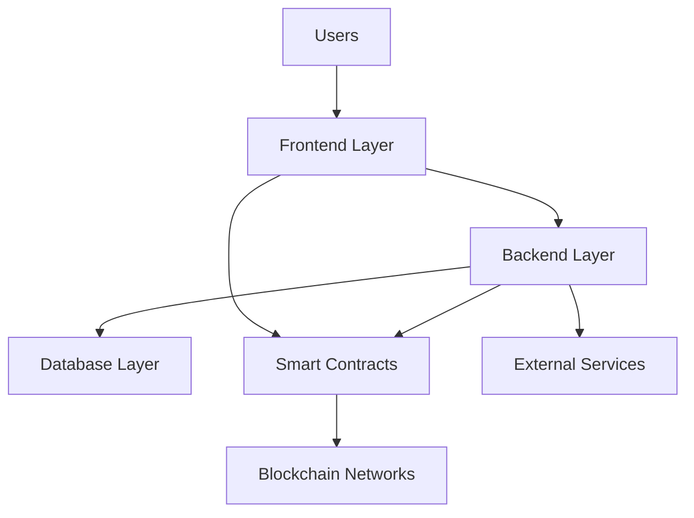

# KudoBit Platform Architecture

## System Overview

KudoBit is a **3-tier decentralized commerce platform** that combines traditional web development with blockchain technology:



## Frontend Architecture

### **Technology Stack**
- **Framework**: React 18 with TypeScript
- **Routing**: TanStack Router (file-based, type-safe)
- **Styling**: TailwindCSS + shadcn/ui components
- **State Management**: TanStack Query + Zustand
- **Web3**: Wagmi v2 + Viem for blockchain interactions
- **Build Tool**: Vite for fast development

### **Component Structure**
```
src/
├── routes/                  # Page-level components (TanStack Router)
│   ├── __root.tsx          # Root layout
│   ├── index.tsx           # Home page
│   ├── creator/            # Creator-specific pages
│   ├── dao/               # DAO governance pages
│   ├── analytics/         # Analytics dashboards
│   └── ...
│
├── components/             # Reusable UI components
│   ├── ui/                # Base UI components (shadcn)
│   ├── auth-steps/        # Authentication flow
│   ├── dashboard/         # Dashboard widgets
│   └── ...
│
├── lib/                   # Core services & utilities
│   ├── wagmi-config.ts    # Web3 configuration
│   ├── creator-service.ts # Creator management
│   ├── analytics-service.ts # Analytics data
│   └── ...
│
└── hooks/                 # Custom React hooks
    ├── use-auth-flow.ts
    ├── use-creator.ts
    └── ...
```

### **State Management Pattern**
- **Server State**: TanStack Query for API data
- **Client State**: Zustand stores for UI state
- **Web3 State**: Wagmi hooks for blockchain data
- **URL State**: TanStack Router for navigation state

## Backend Architecture

### **Technology Stack**
- **Runtime**: Node.js with Hono framework
- **Database**: SQLite (development) / PostgreSQL (production)
- **Authentication**: JWT + SIWE (Sign-In with Ethereum)
- **Real-time**: WebSocket for chat features
- **File Storage**: IPFS integration via Pinata
- **Event Processing**: Blockchain event indexer

### **Service Layer Structure**
```
backend/
├── controllers/            # Request handlers & business logic
│   ├── authController.js   # Authentication
│   ├── creatorController.js # Creator management
│   ├── analyticsController.js # Platform analytics
│   ├── daoController.js    # Governance
│   └── ...
│
├── routes/v1/             # API endpoint definitions
│   ├── index.js          # Route aggregation
│   ├── authRoutes.js     # Auth endpoints
│   ├── analyticsRoutes.js # Analytics endpoints
│   └── ...
│
├── middleware/            # Request processing
│   ├── auth.js           # JWT authentication
│   ├── validation.js     # Input validation
│   └── security.js       # Security headers
│
├── services/              # Business logic services
│   ├── authService.js
│   ├── creatorService.js
│   └── ...
│
├── websocket/             # Real-time features
│   └── chatServer.js     # WebSocket chat
│
└── database-sqlite.js    # Data access layer
```

### **API Design Patterns**
- **RESTful Architecture**: Standard HTTP methods and status codes
- **Resource-based URLs**: `/api/v1/creators`, `/api/v1/products`
- **Consistent Response Format**: 
  ```json
  {
    "success": true,
    "data": {...},
    "pagination": {...}
  }
  ```
- **Error Handling**: Structured error responses with proper HTTP codes
- **Authentication**: Bearer token in Authorization header

## Database Architecture

### **Data Model Overview**
```sql
-- Core entities
creators ←→ products ←→ purchases
    ↓           ↓
sessions    reviews
    ↓           ↓  
wishlist    loyalty_badges

-- Governance
dao_proposals ←→ dao_votes
       ↓
    treasury

-- Community  
forum_posts ←→ forum_replies
      ↓
   users

-- Business
collaborative_products
affiliate_programs ←→ referral_purchases
```

### **Key Tables & Relationships**

#### **Core Commerce**
- `creators` - Creator profiles and verification status
- `products` - Digital product catalog with metadata
- `purchases` - Transaction records linking buyers to products
- `sessions` - User authentication sessions

#### **Community Features**  
- `wishlist` - User saved products for future purchase
- `product_reviews` - Ratings and feedback system
- `forum_posts` - Community discussion threads
- `forum_replies` - Threaded responses to posts

#### **Governance**
- `dao_proposals` - Platform governance proposals
- `dao_votes` - User voting records with weighted power
- `loyalty_badges` - NFT badge ownership tracking

#### **Business Logic**
- `collaborative_products` - Multi-creator revenue sharing
- `affiliate_programs` - Referral tracking system
- `referral_purchases` - Commission calculations

## Smart Contract Architecture

### **Contract Ecosystem**
```
Smart Contracts/
├── Core/
│   ├── CreatorStore.sol     # Main marketplace logic
│   ├── LoyaltyToken.sol     # ERC-1155 reward badges  
│   └── MockUSDC.sol         # ERC-20 payment token
│
├── Extensions/
│   ├── SimpleKudoBitDAO.sol # Governance system
│   ├── CollaborativeProductFactory.sol # Multi-creator products
│   ├── AffiliateProgram.sol # Referral system
│   └── SecondaryMarketplace.sol # Resale functionality
│
└── Utilities/
    ├── Categories.sol       # Product categorization
    ├── Reviews.sol         # On-chain reviews
    └── ContentAccess.sol   # Access control
```

### **Key Smart Contract Features**

#### **CreatorStore.sol**
- Product creation and management
- USDC payment processing  
- Automatic loyalty badge minting
- Revenue tracking and distribution

#### **LoyaltyToken.sol** 
- ERC-1155 multi-token standard
- Four badge tiers: Bronze, Silver, Gold, Diamond
- Automatic minting based on purchase volume
- IPFS metadata for badge artwork

#### **SimpleKudoBitDAO.sol**
- Proposal creation and voting
- Token-weighted governance
- Treasury management
- Execution of passed proposals

## Data Flow Architecture

### **User Registration & Authentication**
```
1. User connects wallet → Frontend (Wagmi)
2. Generate SIWE message → Frontend
3. User signs message → MetaMask
4. Verify signature → Backend (/auth/login)  
5. Generate JWT token → Backend
6. Store session → Database
7. Return token → Frontend
8. Store in localStorage → Frontend state
```

### **Product Creation Flow**
```
1. Creator fills form → Frontend (/creator/create-product)
2. Upload files to IPFS → Backend (/ipfs/upload)
3. Create product record → Backend (/products)
4. Store metadata → Database
5. Deploy/update contract → Smart Contract
6. Index events → Event Indexer
7. Update analytics → Analytics Service
```

### **Purchase Flow**
```
1. User initiates purchase → Frontend
2. Approve USDC spend → Smart Contract  
3. Execute purchase → CreatorStore.sol
4. Mint loyalty badge → LoyaltyToken.sol
5. Emit events → Blockchain
6. Index purchase → Backend Event Indexer
7. Update database → Backend
8. Send notifications → WebSocket
9. Update analytics → Analytics Service
```

## Integration Patterns

### **Frontend ↔ Backend**
- **API Client**: Centralized HTTP client with error handling
- **Authentication**: JWT token in Authorization header
- **State Sync**: TanStack Query for server state caching
- **Real-time**: WebSocket connection for live updates

### **Backend ↔ Blockchain**
- **Event Indexing**: Listen to contract events for data sync
- **Transaction Monitoring**: Track purchase confirmations
- **Multi-chain**: Support for 6+ EVM networks
- **Fallback Patterns**: Graceful degradation if blockchain unavailable

### **External Services**
- **IPFS (Pinata)**: Decentralized file storage
- **Analytics**: Platform metrics and insights
- **Email (Optional)**: Notifications and KYC updates
- **WebSocket**: Real-time chat and notifications

## Security Architecture

### **Authentication & Authorization**
- **SIWE**: Cryptographic proof of wallet ownership
- **JWT Tokens**: Stateless session management
- **Role-based Access**: Creator vs. user permissions
- **API Rate Limiting**: Prevent abuse

### **Data Protection**
- **Input Validation**: Comprehensive sanitization
- **SQL Injection Prevention**: Parameterized queries
- **CORS Policy**: Restricted cross-origin access
- **File Upload Security**: Type validation and scanning

### **Smart Contract Security**
- **OpenZeppelin Standards**: Battle-tested contract libraries
- **Reentrancy Protection**: Prevent recursive calls
- **Access Control**: Role-based contract permissions
- **Pausable Contracts**: Emergency stop functionality

## Performance & Scalability

### **Frontend Optimization**
- **Code Splitting**: Route-based lazy loading
- **Image Optimization**: WebP format with lazy loading
- **Bundle Optimization**: Tree shaking and minification
- **Caching**: Service worker for offline capability

### **Backend Scaling**
- **Database Indexing**: Query optimization
- **Connection Pooling**: Efficient database connections
- **Caching Layer**: Redis for frequently accessed data
- **Horizontal Scaling**: Stateless design for load balancing

### **Blockchain Optimization**
- **Gas Optimization**: Efficient contract bytecode
- **Batch Operations**: Multiple actions in single transaction
- **Layer 2 Integration**: Lower costs with rollups
- **Event Optimization**: Minimal on-chain data storage

## Deployment Architecture

### **Development Environment**
```
Local Development:
├── Frontend: http://localhost:5173 (Vite dev server)
├── Backend: http://localhost:5000 (Node.js + Hono)
├── Database: SQLite file (./backend/kudobit.db)
└── Blockchain: Hardhat local network
```

### **Production Environment**  
```
Production Stack:
├── Frontend: Vercel/Netlify (Static deployment)
├── Backend: Railway/Render (Container deployment)
├── Database: PostgreSQL (Managed service)
├── CDN: Cloudflare (Global content delivery)
└── Monitoring: DataDog/LogRocket (Observability)
```

## Monitoring & Analytics

### **Application Monitoring**
- **Error Tracking**: Sentry for exception monitoring
- **Performance**: Core Web Vitals and API response times
- **User Analytics**: Privacy-focused usage tracking
- **Uptime Monitoring**: Service availability alerts

### **Business Intelligence**
- **Platform Analytics**: User acquisition and retention
- **Creator Metrics**: Revenue and engagement insights  
- **Transaction Analytics**: Payment flow optimization
- **Governance Insights**: DAO participation metrics

---

This architecture provides a **robust, scalable foundation** for decentralized commerce while maintaining the user experience expectations of traditional e-commerce platforms.